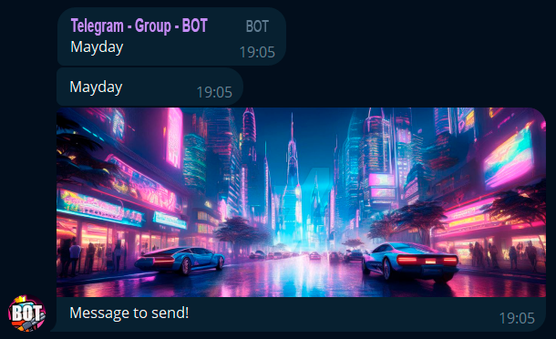

# BotBridgeGS
BotBridgeGS is a Google Apps Script project designed to automate notifications and manage scheduled events for a Telegram group. It uses Google Sheets data and integrates with Telegram's Bot API to send notifications and updates to administrators, ensuring real-time communication and tracking.

## Features
- **Automatic Notifications**: Send notifications to Telegram administrators using a custom message and optional photo.
- **Scheduled Reminders**: Set up scheduled reminders based on various events (e.g., hourly, daily, etc.).
- **Telegram Integration**: Seamlessly integrates with Telegram groups to notify admins and send multimedia content.
- **Google Sheets Interaction**: Automates tasks based on Google Sheets data, such as calculating top N values or counting occurrences.
- **Modular Structure**: Organized into separate files for deployment, notification handling, utilities, and triggers.

## File Overview
- `deploy.gs`: Handles HTTP GET requests for triggering notifications via a web app interface. It processes URL parameters (message and photoUrl) and calls the function to notify admins. It also includes a helper to generate the URL for notifications.
- `notifier.gs`: Manages the logic for sending messages to Telegram admins, including handling photo attachments and dividing admin notifications into manageable chunks.
- `sheetUtils.gs`: Contains utility functions for Google Sheets, such as summing the top N largest values in a range, counting occurrences of a specific value, and highlighting important cells based on predefined rules.
- `triggerHandlers.gs`: Implements example functions and scheduled reminders for specific events like clan expeditions, sending automated notifications on specific days of the week.

## Example Usage
Here’s an example of sending a notification:
```
function example(){
  var message = "Message to send!";
  var photo = "YOUR_PHOTO_URL";

  notify_admins(message,photo);
}
```
### Setting Up Triggers
You can automate the notifications using triggers in Google Apps Script. Follow these steps to set up a trigger for the `example` function:


1. In the Google Apps Script editor, go to Triggers (clock icon in the left sidebar).
2. Click on + Add Trigger.
3. Choose `example` as the function to run.
4. Set the event type that triggers the function (for example, on a time-based trigger or when a certain condition is met).
5. Save the trigger settings.

### Sample Notification

Here is an example of how the notification sent by the bot will look like:


### Sample Notification with photo

Here is an example of how the notification sent by the bot will look like:




## How to Set Up
1. Clone or download this repository.
2. Open Google Sheets and go to Extensions > Apps Script.
3. Upload all `.gs` files into the Apps Script editor.
4. Replace placeholder values (e.g., bot token, chat ID) with your actual Telegram bot details in `notifier.gs`:
   - In the `notifier.gs` file, find the following lines:
     ```javascript
     const botToken = 'YOUR_BOT_TOKEN';
     const chatId = 'YOUR_CHAT_ID';
     ```
     - Replace `'YOUR_BOT_TOKEN'` with your actual bot token, which you can get from the BotFather.
     - Replace `'YOUR_CHAT_ID'` with the ID of your Telegram chat (usually a negative number for groups). You can get this by interacting with your bot in the group and using the `getUpdates` method from the Telegram Bot API.

5. Deploy the script as a web app:
   - In the Apps Script editor, go to **Publish > Deploy as web app**.
   - Choose **Execute the app as** — *Me*, and **Who has access** — *Anyone, even anonymous*.
   - After deploying, copy the provided web app URL.
6. Update the webhook URL in the `deploy.gs` file:
   - Replace the placeholder URL in this line:

     ```javascript
     var url_copy = "YOUR_WEB_APP_URL";
     ```

     with the URL you received after deploying the web app.

## Scheduled Notifications
The script includes predefined reminders such as:
- **Daily Updates**: Sends daily notifications with important information or tasks.
- **Event Reminders**: Sends notifications for specific phases of ongoing events or activities, such as the start or continuation of important milestones.

## Contributing
Feel free to submit issues or pull requests for improvements, bug fixes, or new features.
